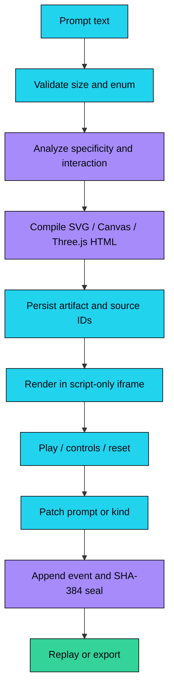

<div align="center">

# Prompt Forge

### Prompts in. Runnable things out.

[](https://prompt-forge-neon-one.vercel.app)
[](https://nextjs.org)
[](https://www.typescriptlang.org)
[](LICENSE)
[](#-agent-interface)

[Live App](https://prompt-forge-neon-one.vercel.app) · [GitHub source](https://github.com/aniruddhaadak80/prompt-forge) · [Health](https://prompt-forge-neon-one.vercel.app/api/health) · [Agent](https://prompt-forge-neon-one.vercel.app/agent) · [Issues](https://github.com/aniruddhaadak80/prompt-forge/issues)

</div>

Prompt Forge is a research-backed prompt-to-playable artifact workbench. It turns sourced AI creation prompts into inspectable SVG instruments, browser games, Three.js studies, and simulations that can be played, revised, verified, and exported.

The core experience is keyless. It does not pretend to call GPT-6 Astra or Claude Opus 5.5 at runtime; it uses a deterministic compiler so a visitor can understand exactly what was generated, what state changed, and which sources informed the brief.

> The public research shelf includes official model pages, public repositories, DEV articles, and indexed public posts. Claims remain attributed to their publishers. Prompt Forge does not claim affiliation with OpenAI, Anthropic, or any linked creator.

## ✨ Features

- **Prompt-to-artifact compiler** — choose SVG, 2D arcade, 3D orbit, or climate simulation and receive a real self-contained browser artifact.
- **Playable previews** — generated HTML runs inside a script-only iframe with controls, reset behavior, and runtime telemetry.
- **Research shelf** — live GitHub and DEV Community results are normalized; a dated fallback is explicitly labeled.
- **Working CRUD** — create, read, revise, retire, search, filter, and export builds through the UI and REST API.
- **Explainable engine** — five weighted factors, itemized contributions, a recommendation, and a versioned SHA-384 seal.
- **Agent surface** — JSON-RPC `initialize`, `tools/list`, and `tools/call`, including real mutations.
- **Integrity replay** — create, update, and retire events are chained and replayable.
- **Anonymous ownership** — an HTTP-only scope cookie keeps visitor-created records isolated without requiring accounts.
- **Local-first start** — no environment variables are required locally; Neon is selected when `DATABASE_URL` is present.

## 🧭 Jobs to be done

- A curious builder can compile a sourced prompt so that they can inspect a runnable artifact instead of a wall of text.
- A reviewer can revise a brief and replay its seal so that they can understand what changed before sharing it.
- A coding agent can call the public MCP tools so that it can create and verify a build through the same service as the browser.

## 🗺️ Product map

| Route | User goal | API |
| --- | --- | --- |
| `/` | Enter the lab and see featured artifacts | — |
| `/build` | Compile a prompt into a runnable artifact | `GET/POST /api/builds` |
| `/build/[id]` | Play, revise, verify, export, or retire a build | `GET/PATCH/DELETE /api/builds/[id]` |
| `/library` | Search and filter the public/current-scope shelf | `GET /api/builds` |
| `/library/[id]` | Canonical detail redirect | — |
| `/method` | Understand the compiler, score, and integrity model | — |
| `/agent` | Call the public JSON-RPC tools | `GET/POST /api/mcp` |
| `/export` | Download a Markdown build report | `GET /api/export?id=...` |
| `/api/feed` | Read live or fallback research | `GET /api/feed` |
| `/api/health` | Verify the active persistence path | `GET /api/health` |
| `/api/engine` | Analyze a prompt without saving it | `POST /api/engine` |
| `/api/verify` | Replay a build chain | `GET /api/verify?id=...` |
| `/api/openapi` | Read the REST contract | `GET /api/openapi` |

## 🚀 Quickstart

```bash
git clone https://github.com/aniruddhaadak80/prompt-forge.git
cd prompt-forge
npm ci
npm run dev
```

Open `http://localhost:3000`. Local development uses a seeded process-local adapter and requires no environment variables. Production uses Neon Postgres:

```bash
DATABASE_URL=<neon-connection-string>
NEXT_PUBLIC_SITE_URL=https://prompt-forge-neon-one.vercel.app
```

The first production request creates the tables and idempotently seeds the public examples from `db/schema.sql` and `src/lib/seed.ts`.

## 🏗️ Architecture

```mermaid
flowchart LR
  Browser[Browser routes] --> API[Next.js route handlers]
  Agent[JSON-RPC client] --> RPC[/api/mcp]
  API --> Domain[Shared domain services]
  RPC --> Domain
  Domain --> Compiler[Deterministic artifact compiler]
  Domain --> Engine[Explainable engine]
  Domain --> Store[(Neon Postgres)]
  Domain --> Feed[GitHub + DEV normalizer]
  Compiler --> Iframe[Sandboxed iframe]
  Engine --> Seal[SHA-384 seal]
  Store --> Export[Markdown exporter]
  classDef data fill:#22d3ee,color:#04060c,stroke:#04060c
  classDef engine fill:#a78bfa,color:#04060c,stroke:#04060c
  classDef agent fill:#34d399,color:#04060c,stroke:#04060c
  classDef external fill:#fbbf24,color:#04060c,stroke:#04060c
  classDef infra fill:#94a3b8,color:#04060c,stroke:#04060c
  class Browser,API,Domain,Store,Export data
  class Compiler,Engine,Seal engine
  class Agent,RPC agent
  class Feed external
  class Iframe infra
```

The compiler, engine, repository, and exporter are shared by UI, REST, and MCP. There is no second calculation path hidden in a component.

## 🔄 Artifact pipeline



## 🔌 API

Create and read back a build:

```bash
curl -X POST "$APP/api/builds" \
  -H 'content-type: application/json' \
  -c cookies.txt \
  -d '{"title":"Signal Run","prompt":"Create a playable browser arcade with keyboard controls, hazards, a score loop, reset, and a visible readout.","kind":"arcade","sourceIds":["openai-astra-official"]}'

curl "$APP/api/builds/BUILD_ID" -b cookies.txt
curl -X PATCH "$APP/api/builds/BUILD_ID" -b cookies.txt \
  -H 'content-type: application/json' \
  -d '{"prompt":"Create a playable browser arcade with keyboard controls, hazards, a score loop, reset, and a visible runtime readout."}'
```

Run the engine without persistence:

```bash
curl -X POST "$APP/api/engine" \
  -H 'content-type: application/json' \
  -d '{"prompt":"Build a Three.js study with drag controls, zoom, reset, and a phase readout.","kind":"orbit","sourceIds":["openai-astra-official"]}'
```

Verify and export:

```bash
curl "$APP/api/verify?id=BUILD_ID"
curl -L "$APP/api/export?id=BUILD_ID" -o build.md
```

## 🤖 Agent interface

The endpoint is `POST /api/mcp` with JSON-RPC 2.0. `GET /api/mcp` returns discovery metadata. Available tools are `list_builds`, `analyze_prompt`, `create_build`, `update_build`, `verify_chain`, and `export_build`.

```json
{
  "mcpServers": {
    "prompt-forge": {
      "type": "http",
      "url": "https://prompt-forge-neon-one.vercel.app/api/mcp"
    }
  }
}
```

The in-page console at [`/agent`](https://prompt-forge-neon-one.vercel.app/agent) proves the same path with real initialize, tool discovery, and mutation calls.

## 🔐 Integrity model

Each create, update, or retire event stores `SHA-384(previousSeal || canonicalJson(event))`. Canonical JSON recursively sorts object keys and preserves array order. `GET /api/verify?id=...` replays the chain and returns the first broken sequence when a link no longer matches. Hash chaining provides tamper evidence; it is not encryption or access control.

## 🧪 Verification

```bash
npm run lint
npm run typecheck
npm run test
npm run build
npx playwright test
```

`npm run verify:live` accepts `BASE_URL` and performs a real create → read → update → engine → MCP → verify → export → retire sequence against a deployed alias.

## 🗺️ Roadmap

### Now

- [x] Ship real SVG, canvas, and Three.js artifact templates.
- [x] Add persistent build CRUD with anonymous ownership.
- [x] Add live research normalization and labeled fallback.
- [x] Add deterministic scoring, seals, replay, and export.
- [x] Add JSON-RPC agent tools and browser console.

### Next

- [ ] Add optional authenticated workspaces for teams that need shared private collections.
- [ ] Add source refresh jobs with publisher-specific rate-limit telemetry.
- [ ] Add a visual diff view for artifact revisions.

### Later

- [ ] Add a community review layer with signed critique records.
- [ ] Add optional model adapters for users who explicitly configure a provider key.
- [ ] Add a benchmark runner that compares multiple compiler profiles on the same brief.

## 📚 Research and attribution

The seeded shelf points to official OpenAI and Anthropic model pages, public GitHub repositories, DEV Community articles, and indexed public LinkedIn posts. The app stores short attributed excerpts and source URLs; it does not mirror private data or claim that a linked creator endorses Prompt Forge. Live feed failures return a dated fallback with `source: "fallback"`.

## 🤝 Contributing

Read [CONTRIBUTING.md](CONTRIBUTING.md) before opening a pull request. Keep changes focused, add a test for behavior changes, and never commit credentials or generated build output.

## License

MIT. See [LICENSE](LICENSE).
